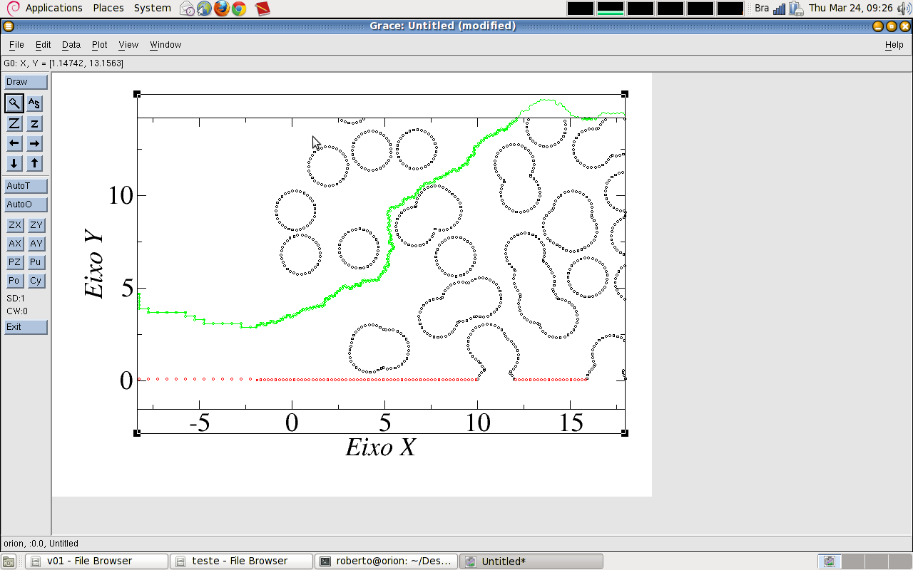

# PartWalk

Autor: Roberto Lima (UFC / Unifor)

## Objetivo do programa

Processar os dados gerados pelo *Ansys Fluent* (malha geométrica e campo de escoamento), e simular particulas pontuais sendo arrastadas pelo campo de escoamento na direção do *fluxo de massa*.

Com o resultado do **PartWalk**, pode-se investigar o tempo de transito das partículas, juntamente com os detalhes das trajetórias de cada partícula.

## Arquivos

 - dados_cell.txt.gz (gerado pelo fluent);
 - dados_line.txt (gerado pelo fluent)
 - Makefile
 - PartWalk.cpp (main file)
 - headers (diretorio de headers)
 - libs (diretorio de bibliotecas, compiladas para arquitetura x86_64)

##  Executando

A seguir estão os passos para verificar se o programa está funcionando.

### 1. Descompactar

`$ gzip -d dados_cell.tex.gz`

Esta descompatação é necessário pois o programa **PartWalk** apenas interpreta textos puros.

Caso deseje compactar novamente, use:
`$ gzip dados_cell.tex`

### 2. Compilar

`$ make`

### 3. Executar

`$ make run`

## Análise dos resultados

Serão gerados alguns arquivos de dados.

Os arquivos "geo_" possuem os pontos geométricos xy da estrutura analisada.

Os arquivos "trajetoria_" possuem os pontos xy da trajetório de cada partícula.

Podemos utilizar algum programa que gere gráficos, como o Xmgrace, que plote os pontos em *escala fixa*. A figura gerada deve ter apenas pontos (sem linhas).

A Figura "Resultado.png" mostra o resutado gerado no Xmgrace com os arquivos de dados de saída do **PartWalk**.

#### FIM
